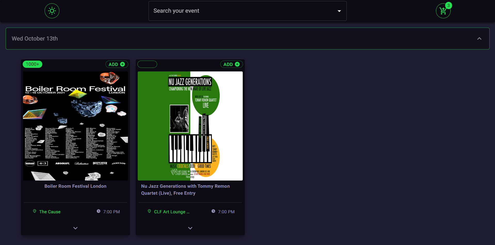
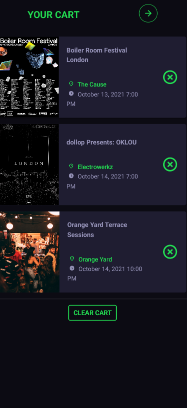
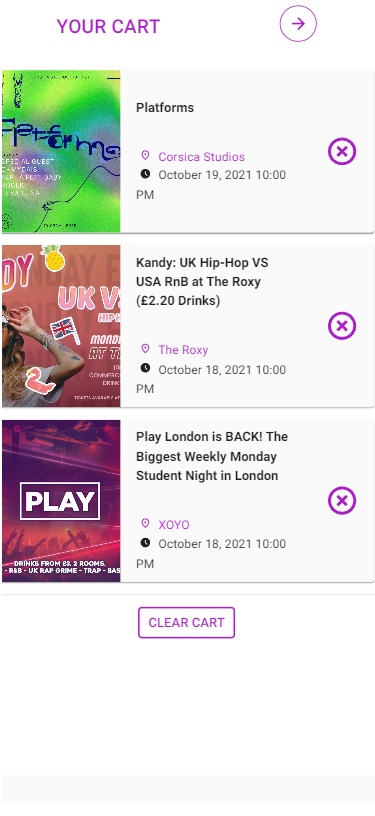

## Techlead Frontend Assignment

Implemented by Luca Stendardo

## Description

A React app that allows users to participate in concerts and music events. it was a pleasure and a really nice exercise to implement it and most of all it was a lot of fun to learn how to use Material UI.

## Tech Stack

- [React.js](https://reactjs.org/)
- [Redux Toolkit](https://redux-toolkit.js.org/)
- [Axios](https://axios-http.com/docs/intro)
- [Material UI](https://mui.com/)
- [moment.js](https://momentjs.com/)
- [lodash](https://lodash.com/)
- [react-toastify](https://www.npmjs.com/package/react-toastify)

## Preview

Here's a little preview

<div 
display="flex"
flex-direction="row">
    
    
    
</div>

## Run locally

### Frontend

Navigate to the client folder and run the following commands

```bash
npm install
```

```bash
npm start
```

Now it should be running on your browser!

## Contact

Luca Stendardo - [LinkedIn](https://www.linkedin.com/in/luca-stendardo/?locale=en_US) - stendardo.lu@gmail.com
